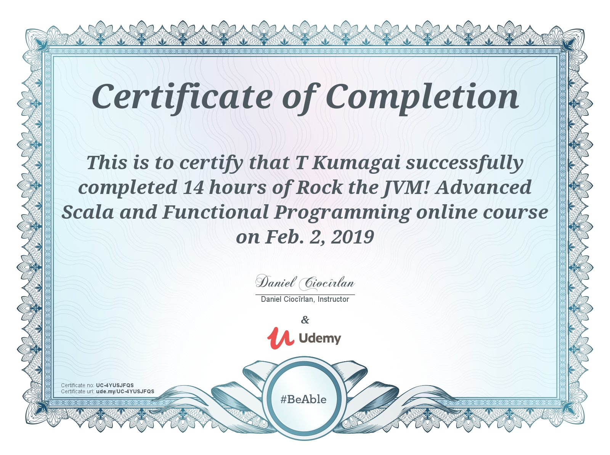

# Scala Advanced

## Udemy Site

<https://www.udemy.com/advanced-scala>

## Udemy Cource
Rock the JVM! Advanced Scala and Functional Programming

Future Map

<pre>
<code>
def someone = ???
</code>

<code>
</code>
</pre>

